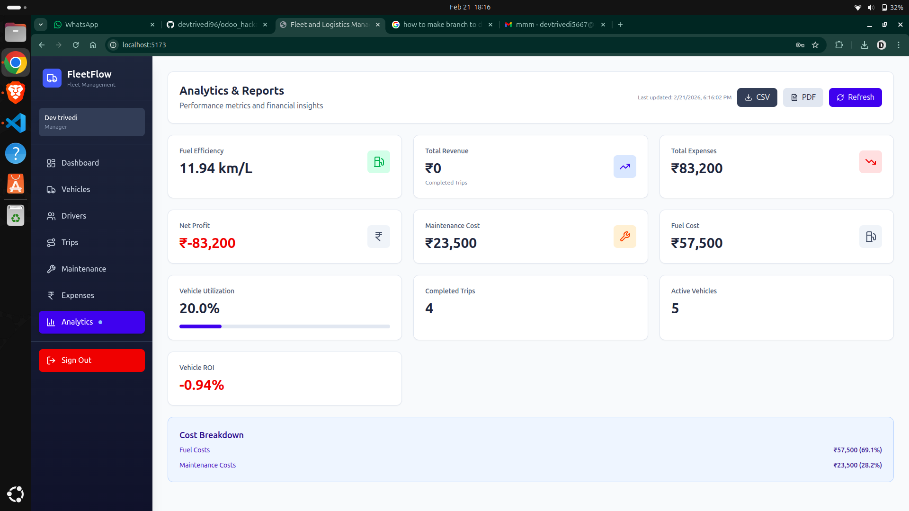

# Analytics Component

This image shows the Analytics Dashboard, visualizing key metrics such as fuel efficiency, vehicle ROI, and cost-per-km. Charts and tables provide actionable insights for fleet managers and analysts, enabling data-driven decisions. Export options for CSV/PDF are visible, supporting payroll and audit workflows.

- **Purpose:**
  - Visualize key metrics such as fuel efficiency, vehicle ROI, and cost-per-km.
  - Enable data-driven decision making for fleet managers and analysts.
  - Export reports for payroll and audits.

- **Features:**
  - Fuel efficiency (km/L) and cost analysis.
  - Vehicle ROI calculation.
  - Export to CSV/PDF.
