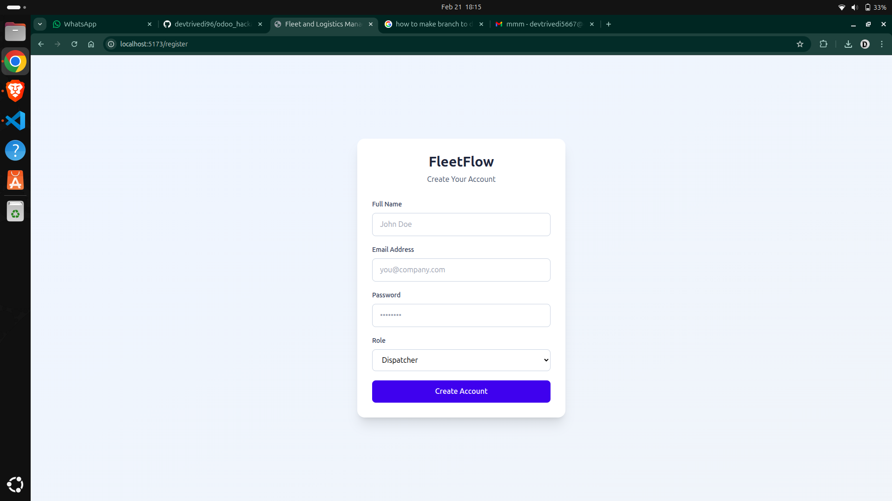
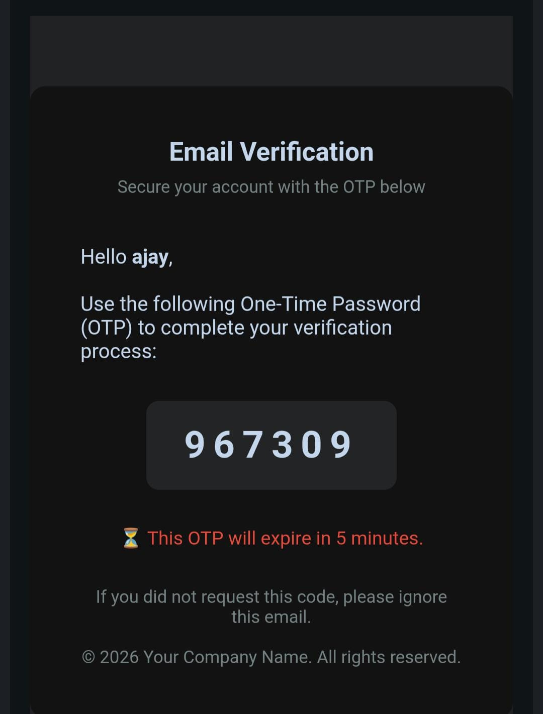

# Auth Components

These images illustrate the authentication flow: sign-in for secure access, registration for onboarding new users, and OTP verification for email validation. Each screen enforces role-based access control, ensuring only authorized users can access system features.

Handles user authentication and registration workflows.

- **Login.tsx**: User login form with email/password fields and role-based access control.
- **Register.tsx**: Registration form with OTP email verification.
- **VerifyOTP.tsx**: OTP input for email verification.

**Purpose:**
Secures access for different user roles (Manager, Dispatcher, etc.) and manages user onboarding.

**Features:**

- Email/password authentication
- OTP verification
- Role-based access control (RBAC)
- Forgot password (future extension)
