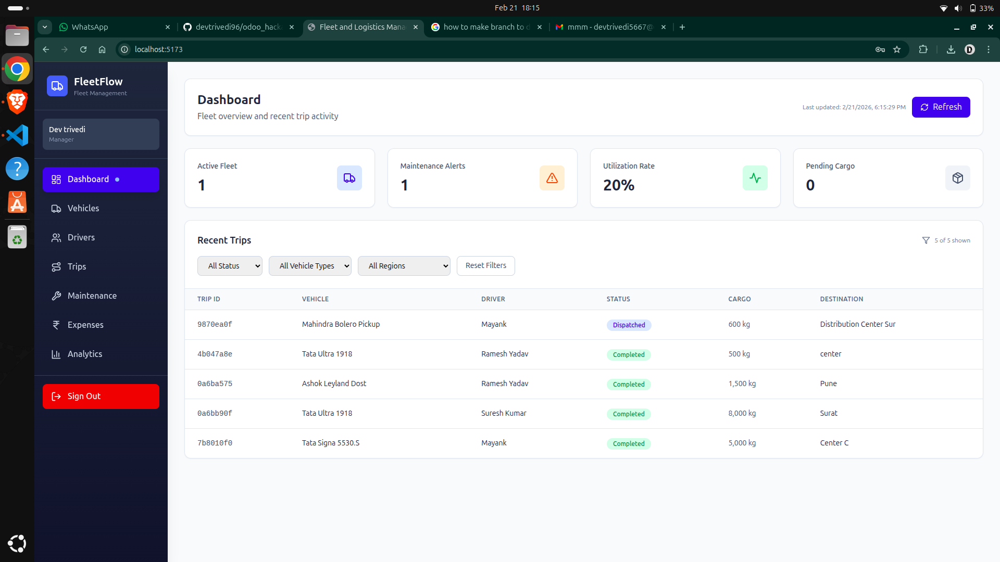
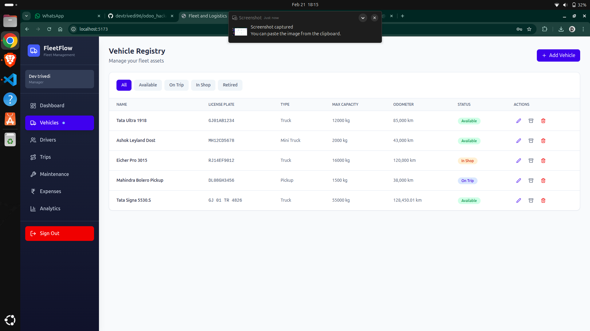

# Dashboard Component

These images show the command center dashboard, displaying KPIs such as active fleet, maintenance alerts, utilization rate, and pending cargo. The manager dashboard provides a high-level overview and quick navigation to other modules, helping users monitor fleet status in real time.

- **Purpose:**
  - Display KPIs such as active fleet, maintenance alerts, utilization rate, and pending cargo.
  - Provide filters by vehicle type, status, or region.

- **Features:**
  - At-a-glance view of fleet status
  - Real-time updates on vehicle and trip status
  - Quick access to other system modules
