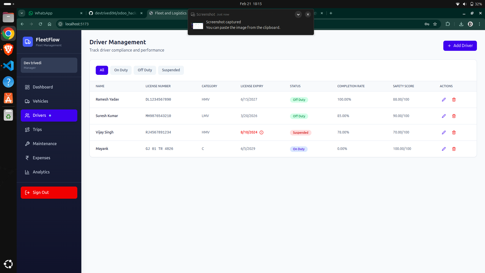

# Driver Management Components

This image shows the driver profile and management interface, where compliance (license expiry, status) and performance (trip completion, safety scores) are tracked. The UI supports managing driver status (On Duty, Off Duty, Suspended) and ensures only compliant drivers are dispatched.

- **DriverForm.tsx**: Form for adding/editing driver details.
- **DriverManagement.tsx**: List and manage drivers, track compliance and performance.

**Purpose:**

- Track driver compliance (license expiry, status)
- Monitor performance (trip completion, safety scores)
- Manage driver status (On Duty, Off Duty, Suspended)
