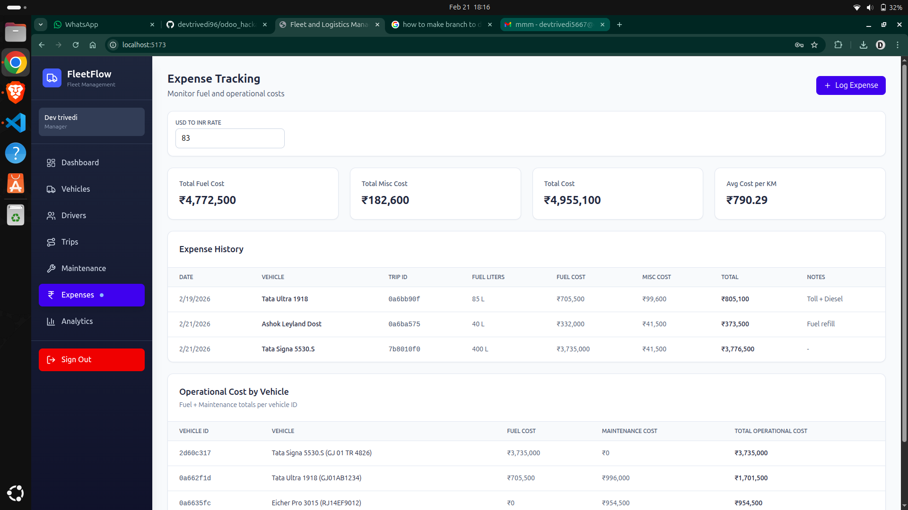

# Expense Tracking Components

This image shows the expense and fuel logging interface, where operational costs (fuel, maintenance) are recorded and analyzed per vehicle. The UI supports financial audits and reporting, helping calculate total operational cost per vehicle.

Handles expense and fuel logging for vehicles.

- **ExpenseForm.tsx**: Form to record fuel, maintenance, and other expenses.
- **ExpenseTracking.tsx**: List and analyze expenses per vehicle.

**Purpose:**

- Track operational costs (fuel, maintenance)
- Calculate total operational cost per vehicle
- Support financial audits and reporting
