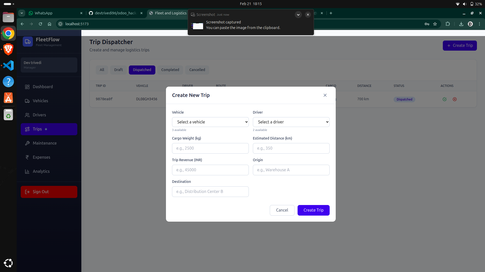
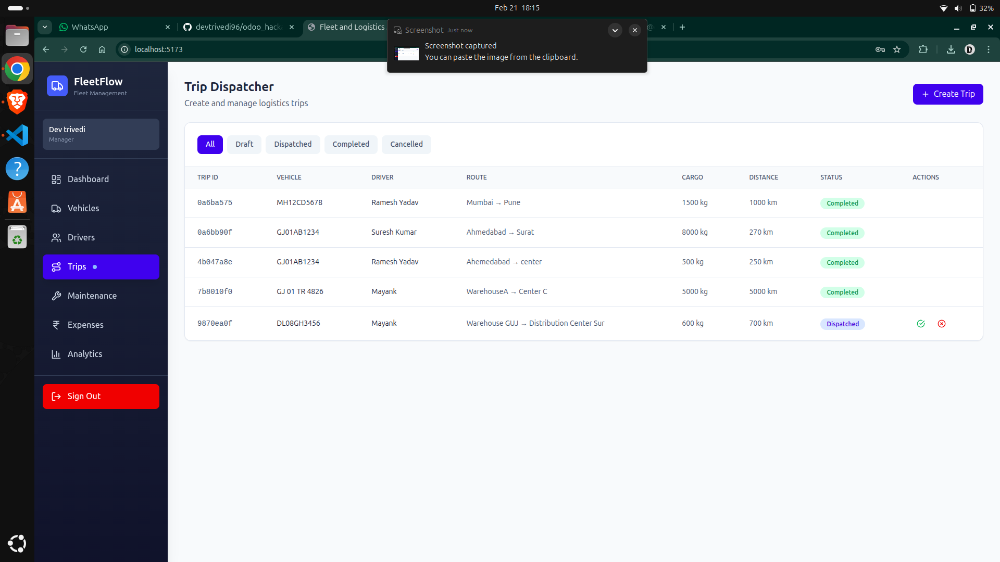

# Trip Management Components

These images show the trip creation and management screens. The UI validates cargo weight vs. vehicle capacity, tracks trip lifecycle (Draft → Dispatched → Completed → Cancelled), and updates vehicle/driver status based on trip progress. The trip overview provides real-time visibility into ongoing and completed trips.

Handles trip creation, dispatching, and lifecycle management.

- **TripDispatcher.tsx**: Assign drivers and vehicles to trips, manage trip status.
- **TripForm.tsx**: Form for creating new trips.

**Purpose:**

- Create and manage trips from Point A to Point B
- Validate cargo weight vs. vehicle capacity
- Track trip lifecycle: Draft → Dispatched → Completed → Cancelled
- Update vehicle and driver status based on trip progress
